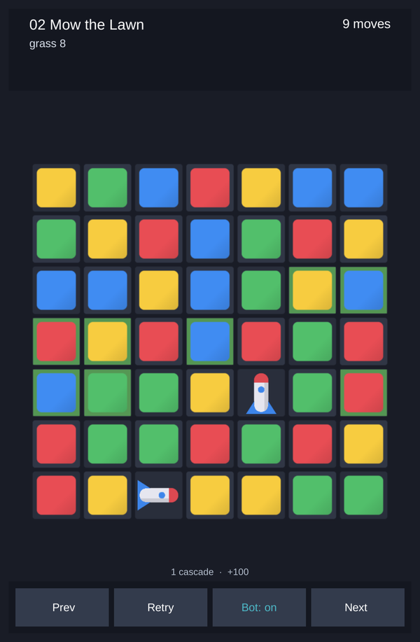
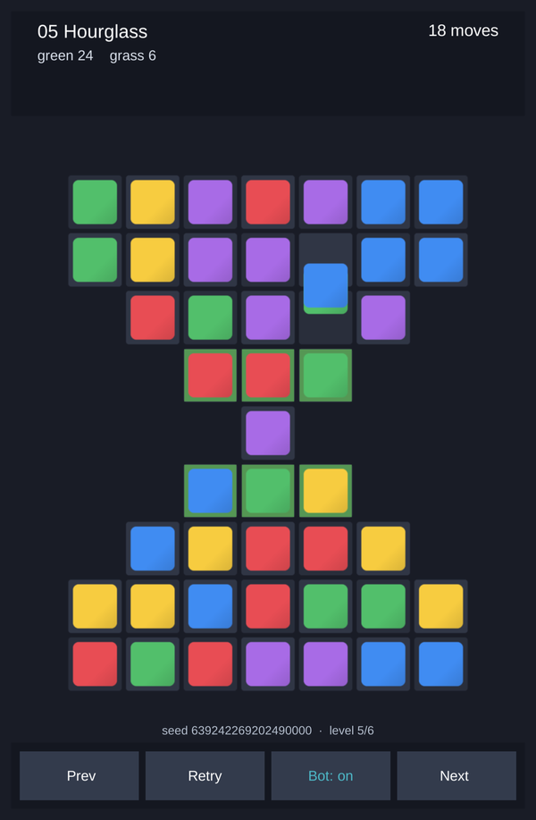
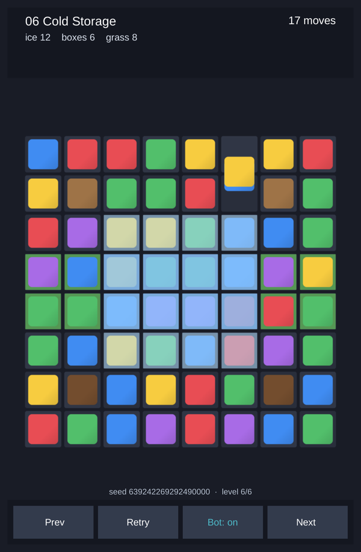

# Match3 Lab

[](https://github.com/RizgarOzan/match3-lab/actions/workflows/tests.yml)

A match-3 **workbench**, not a match-3 game. An engine-independent rules core, a level format
you can read in a diff, and a bot simulator that tells a level designer how hard a level is —
in seconds, before a human ever plays it.

> Status: core, simulator, CLI, Unity presentation, Level Editor and Difficulty Curve windows
> are done (39 core tests + 2 play-mode tests); the WebGL build runs (8.95 MB, gzip-compressed,
> measured). itch.io page and
> a recorded GIF are next — see [Roadmap](#roadmap).

<p align="center">
  
  
  
</p>
<p align="center"><sub>Screenshots taken from the WebGL build with the bot playing (<code>?auto=1</code>). Every sprite is generated at start-up; the project ships no art.</sub></p>

## The question it answers

Casual studios tune every level by having bots play it thousands of times. That tooling is
in-house everywhere and open-source nowhere. This is the open one:

```
$ dotnet run --project tools/Match3Lab.Cli -- curve levels --runs 1000

level                 bot     win%    ±     left  casc  shuf  runs/s
01-first-steps        greedy  100.0   0.0   6.3   2.38  0     2033
01-first-steps        random  70.1    1.4   2.9   1.11  0     10638
02-mow-the-lawn       greedy  98.0    0.4   5.9   2.17  0     1592
02-mow-the-lawn       random  16.7    1.2   2.3   1.12  0     7874
03-crates             greedy  90.8    0.9   7.2   1.25  1     1718
03-crates             random  27.3    1.4   4.0   0.70  3     6098
04-thin-ice           greedy  80.0    1.3   5.3   0.62  242   2041
04-thin-ice           random  29.7    1.4   3.2   0.41  374   5525
05-hourglass          greedy  59.7    1.6   3.9   0.75  49    1786
05-hourglass          random  9.1     0.9   2.5   0.47  73    5988
06-cold-storage       greedy  49.7    1.6   4.3   0.77  72    1570
06-cold-storage       random  3.1     0.5   3.2   0.48  123   5650
```

12,000 games in about five seconds on a laptop (AMD Ryzen 9 270, all cores). Columns: win rate
with its standard error, average moves left when won (slack), cascades per move, how many of the
1000 games dead-ended into a shuffle, and throughput.

**How the six sample levels got their numbers.** They were written by hand in
[`levels/`](levels/). The validator rejected two of them on the first try (goal counts that the
layout could not satisfy). The first curve came back 100 / 100 / 99 / 99 / 94 / 85 % — which
turned out to be a bug in the *bot*, not the levels: it was cloning the game's RNG and choosing
moves with knowledge of which pieces would fall next. With that fixed
([decision 0003](docs/decisions/0003-bots-and-the-foresight-bug.md)) the hard levels dropped by
up to 20 points, and one pass of move-budget changes produced the curve above. Each iteration
took about five seconds.

## What is in the box

```
packages/com.rizgarozan.match3lab.core/   rules core — pure C#, no UnityEngine (a Unity package; the single source of truth)
  Runtime/                                board, matching, specials, gravity, goals, level text format
  Runtime/Simulation/                     bots and the parallel simulator
src/Match3Lab.Core/                       .NET project that compiles the same files for tests and tools
tests/Match3Lab.Core.Tests/               xUnit — 45 tests pin the rules, determinism, the simulator, the tuner and the evolver
tools/Match3Lab.Cli/                      m3lab: validate · show · sim · curve · tune
levels/                                   six hand-authored levels, easy to hard
docs/decisions/                           why things are the way they are (ADRs)
unity/                                    Unity 6 project — playable board, Level Editor, Difficulty Curve, play-mode tests
```

### The Unity side

- **Playable board** that replays the core's event stream (swap → clears → falls → next
  cascade) with pooled sprites; every sprite is drawn at start-up from a signed-distance
  function, so the project ships no art and no import settings. "Bot: on" lets the greedy bot
  play the level on screen. ([decision 0004](docs/decisions/0004-unity-presentation.md))
- **Level Editor window** (`Match3 Lab → Level Editor`): paint cells and layers, edit goals,
  live validation, start-board preview by seed, simulate in place against a target win-rate
  band, and **Auto-tune moves** — the tuner binary-searches the move budget that lands the
  level in the band, in a couple of seconds.
- **Difficulty Curve window** (`Match3 Lab → Difficulty Curve`): the whole `levels/` folder as
  a bar chart with the band shaded, a table, CSV export and click-through to the editor.
- **Play-mode smoke tests** load the generated demo scene and let the bot play it, headless:
  `Unity -batchmode -projectPath unity -runTests -testPlatform PlayMode`.
- The scene is generated by `Match3 Lab → Create Demo Scene`; levels reach the build through
  `Match3 Lab → Sync Levels From Repo` (also runs before every build).

### The rules core

- **Deterministic by construction.** Same level + same seed = same game, on Mono, IL2CPP and
  .NET. Randomness is an in-repo PCG32 verified against the reference outputs; `System.Random`
  is never used. ([decision 0001](docs/decisions/0001-pure-core-and-determinism.md))
- **Events, not callbacks.** `Game.Play(move)` returns the full list of what happened — swaps,
  clears, obstacle hits, specials created and fired, falls, spawns — grouped by phase. The
  presentation layer replays it; it never computes a rule.
- **Royal-Match-shaped rule set:** rockets, bombs, rainbows and their six combinations; grass,
  ice, boxes and holes; tap-to-fire. Every rule and its reason is in
  [decision 0002](docs/decisions/0002-resolution-rules.md).
- **Bots see what a player sees.** Look-ahead clones use an imagined refill stream, never the
  real one.

### The level format

```
name 05 Hourglass
size 7 9
moves 18
colors 5
goal color 2 24
goal grass 6
grid
. . . . . . .
. . . . . . .
# . . . . . #
# # .g .g .g # #
# # # . # # #
# # .g .g .g # #
# . . . . . #
. . . . . . .
. . . . . . .
```

`.` random piece · `0-5` fixed colour · `#` hole · `b`/`B` box with 1/2 hit points ·
`g`/`G` grass under · `i`/`I` ice over. It round-trips through the parser and the writer, and
the validator explains exactly what is wrong when something is.

## Try it

```
dotnet test tests/Match3Lab.Core.Tests
dotnet run --project tools/Match3Lab.Cli -- validate levels
dotnet run --project tools/Match3Lab.Cli -- show levels/05-hourglass.txt --seed 7
dotnet run --project tools/Match3Lab.Cli -- sim levels/06-cold-storage.txt --runs 2000
dotnet run --project tools/Match3Lab.Cli -- curve levels --runs 1000 --csv curve.csv
dotnet run --project tools/Match3Lab.Cli -- tune levels/01-first-steps.txt --band 0.55:0.80
```

The last one answers "how many moves should this level have?":

```
01 First Steps — band 55–80% (greedy, 400 runs per step)
  11 moves → 100.0%
  60 moves → 100.0%
  1 moves → 0.2%
  30 moves → 100.0%
  15 moves → 100.0%
  8 moves → 95.8%
  4 moves → 51.0%
  6 moves → 84.2%
  5 moves → 70.2%
recommend 5 moves (70.2%)  [was 11]
```

Add `--write` to put the recommendation back into the file (only the `moves` line changes).
Needs the .NET 10 SDK. The Unity side needs Unity 6000.3 with the WebGL module.

## Roadmap

1. ~~Unity presentation~~ — done; **WebGL build on itch.io** in progress.
2. ~~Level editor window~~ — done.
3. ~~Difficulty curve window~~ — done.
4. **Level suggestion loop** — two passes now land a level in a target band: `m3lab tune`
   binary-searches the move budget, and `LevelEvolver` hill-climbs the layout itself — obstacle
   layers, goal sizes, colour count, board shape
   ([decision 0005](docs/decisions/0005-layout-evolver.md)). The evolver is core-only so far;
   next is exposing it behind a confirmation step, since unlike a budget change it rewrites the
   designer's grid.
5. **A better "competent player"** — a bot with one ply of look-ahead for combos, and weights
   fitted to real play sessions once the demo has collected some.

## Known issues

Found by reading the code against [decision 0002](docs/decisions/0002-resolution-rules.md);
each one is a rule bug, not a crash. The remaining ones change measured difficulty, so they are
fixed together with a re-measured curve rather than one at a time.

- ~~A cell that has ice over it and grass under it never loses its grass layer.~~ Fixed: a blast
  crossing the cell now peels a grass layer too, per ADR 0002. The shipped curve is unchanged
  because no shipped level puts grass under ice.
- Because a piece under ice is not removed in the same phase, an ice-covered match group can be
  seen twice and damage an adjacent box twice — ADR 0002 says once per match group.
- `MoveResult.Cascades` counts one too many on tap moves and special combinations, so the
  cascades-per-move column in the curve reads slightly high.
- `MoveBudgetTuner` assumes win rate is monotone in the move budget. It is very nearly so, but
  the bot re-plans when the budget changes, so a binary search can land one move off the edge
  of the band.

## License

MIT — see [LICENSE](LICENSE).
